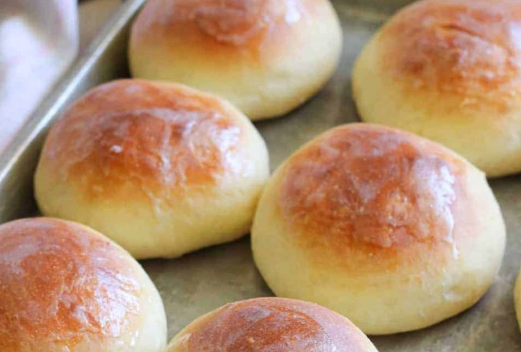

# PERFECT SOFT AND BUTTERY ROLLS

 Things to know

#### Ingredients

- **Whole milk:**  1 1/4 cup
- **Sugar:** 1/2 cup
- **Butter:** unsalted 5 Tablespoon
- **Salt:** 1 1/2 teaspoon
- **Warm water:** 1/4 cup warm water
- **Active dry yeast:** 4 1/2 teaspoons
- **Flour:** 5 cups all-purpose flour
- **Eggs:** 2  large eggs.
- **Unsalted butter:** 2 Tablespoon for brushing after baking 

#### Instructions

- In a medium saucepan over medium-low heat, combine the milk, ½ cup sugar, 5 Tablespoons butter and salt. Heat until mixture is warm and butter is melted (it will start to slightly bubble around the edges of the pan), remove from heat and cool to lukewarm (this is important, because if it's too hot, it will kill the yeast). Meanwhile, in a medium bowl, combine the warm water, 1 teaspoon of sugar and yeast. Allow to sit for 5 to 10 minutes or until bubbly and frothy. If the yeast mixture does not get bubbly and frothy, start yeast mixture over.
- Add three cups of flour to the bowl of your stand mixer. Pour warm milk mixture into the bowl and mix, using the dough hook, until combined, scraping sides of bowl with a rubber spatula as needed. Add the yeast mixture and beaten eggs and mix until combined. Gradually add remaining two cups of flour, ½ cup at a time, or until dough starts to pull away from the sides of the bowl as you mix. Dough should still be slightly sticky to the touch. Don't add too much flour or your rolls will be dry. You may or may not need the entire 5 cups of flour.
- Cover bowl with a towel and allow dough to rise until doubled in size. When dough has risen, punch down. Form dough into balls (if it's a little too sticky, spray your hands with cooking spray). I use about 3 oz. of dough per dough ball. Place on a large greased sheet pan, spacing 2-3 inches apart. Cover with a towel and allow to rise for one hour or until doubled in size.
- Preheat oven to 400 degrees and bake for 12-13 minutes. Tent rolls with foil the last few minutes of baking. The rolls brown pretty quickly, so tenting them with foil is a must. When done baking, brush with remaining 2 Tablespoons of melted butter. Makes around 16 large rolls.

