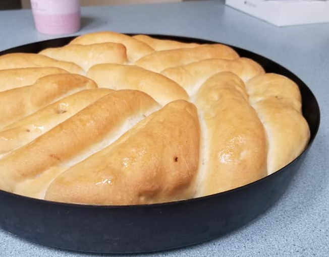
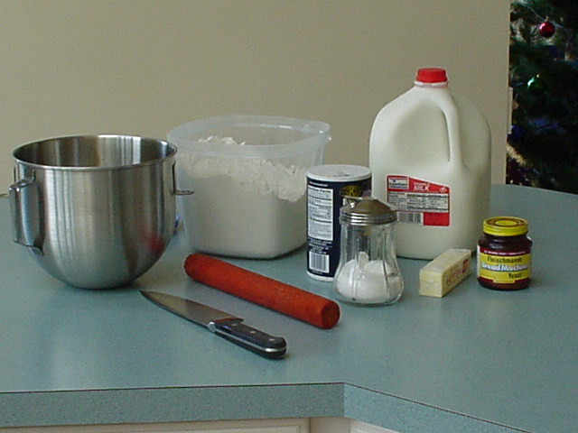
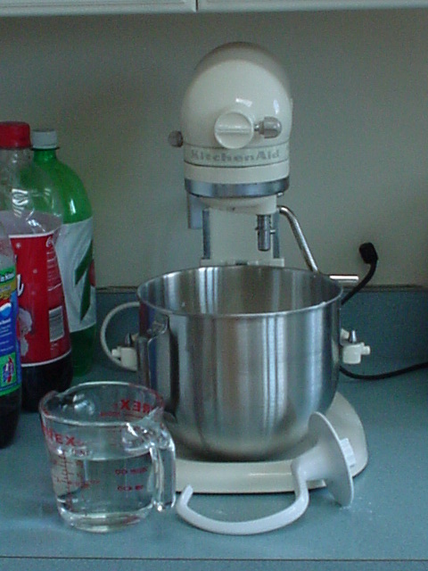
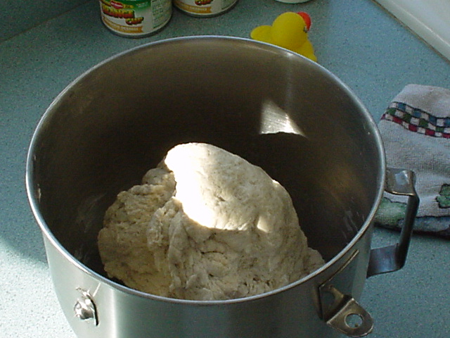
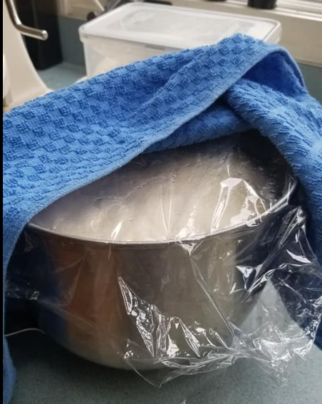
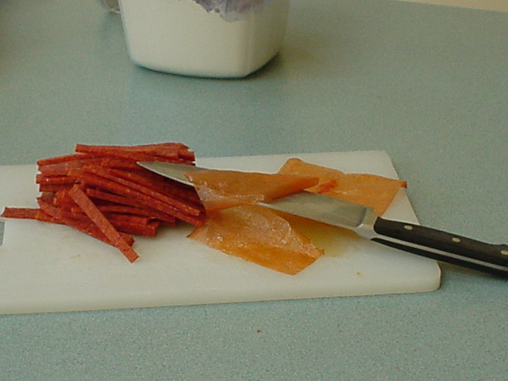
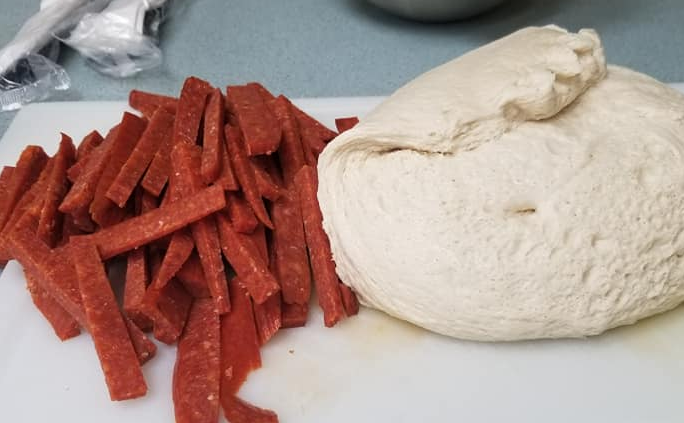
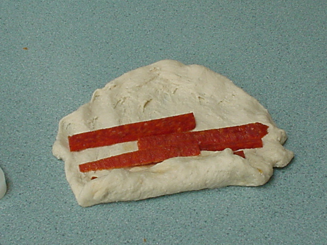
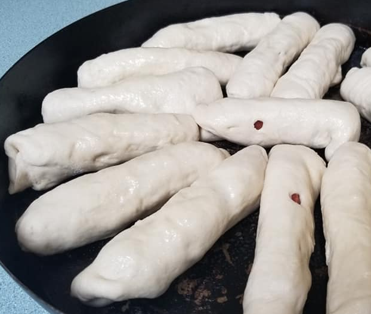
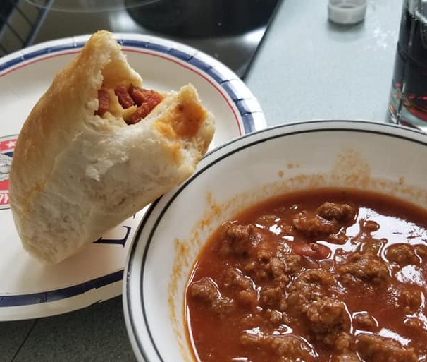

# Pepperoni Rolls

This is the best thing to come out of WV since the invention of coal.

#### Ingredients

- **Sugar:** 1 1/2 tablespoons
- **Butter:**  Just enough to butter the tops when they come out of the oven
- **Salt:** 1 1/2 teaspoon
- **Warm water:** 2 cups warm water, never go over 105 degrees 
- **Active dry yeast:** 2 1/2 teaspoons
- **Flour:** 5 cups all-purpose flour
- **Pepperoni:** 2 full sticks

#### Instructions

- This is the easy mix method.  Using the paddle and not the dough hook put 

  - 2 cups of water
  - 2 cups of flour 
  - 2 1/2 teaspoons of yeast
  - 1 1/2 tablespoons of sugar

- Mix well and let set for 15 minutes or so.  The mixture should be rather soupy. 

- Switch to the dough hook and add remaining flour.  In the end the dough should pull away from the sides of the bowl and be sticky to the touch.   Don't for get the salt at this point as well.  

- Take the dough out of the bowl and form a ball.  Grease the bowl and put the ball back in.  Also, oil the top of the dough so it doesn't get dry while raising.  Cover with plastic wrap and a towel and let it sit until it doubles.  In the summer, just let it sit on the counter.  But in the winter you might need to help the dough stay at 80 degrees by putting it in the oven with the light on.   

- Cover bowl with a towel and allow dough to rise until doubled in size. In the end, it should look like this: 

- While the dough is raising, it is time to cut up the pepperoni.  First realize the sticks of pepperoni have plastic as well as skin on it.  You need to get both of these things off before cooking with it.    
  You can use pepperoni that is pre-cup but I find that to be dried out.  The oil seeping out of the pepperoni into the bread is where all the flavor comes from.  If the pepperoni is dry you loose half the flavor. 

  

- Dump the dough out onto the counter and start rolling pepperoni into it.  You can make these as big or small as you like but the more pepperoni you can fit in there the better the  rolls will be.  

- Arrange the rolls on a pan about 1/4 inch apart.  My sister gives me crap about using this round pizza pan, but I like it because it is heavy gauge steel meant for baking deep dish pizzas.  This gives the bottom of the rolls a good crust.  
  

- Cover the rolls again and let them double in size.  Another hour or so.  Once raised you want the rolls to be touching each other.   This makes the sides deliciously soft when they are pulled apart. 

- Preheat oven to 400 degrees and bake for 20 minutes until golden brown on top. When done baking, brush with remaining 2 Tablespoons of melted butter. 

- If you happened to have made chili at the same time you now have the perfect roll to dunk into it! 
  

