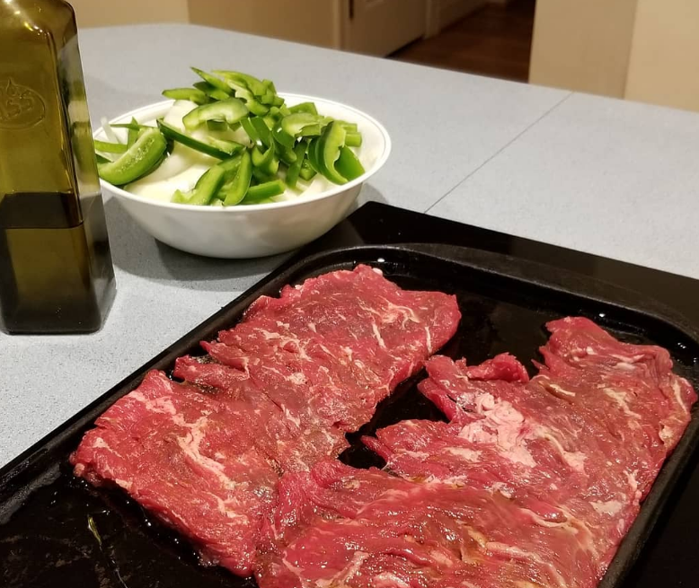
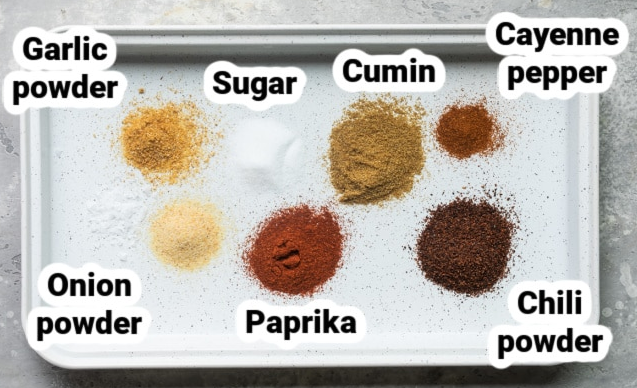

# Fajitas

#### Ingredients

- **Flank Steak:**  2 strips
- **Onion:** 2 large onion chopped long
- **Green peppers:** 3  chopped long as well
- **Oil:**  Just enough to coat the hot plate 
- **Tortillas:**  Anything you like will do
- **Seasoning:** You have 2 choices here.  Buy something or create your own.  If you want to create your own make sure you have the following: 
  - Chili powder
  - Paprika
  - Kosher salt
  - Onion powder
  - Cumin
  - Garlic powder
  - Sugar
  - Cayenne pepper

#### Instructions

- Create your own seasoning eyeballing the ratios using this picture as your guide. 

  

  No need to be too picky here.  Just be careful not to add too much spice or cumin.  

- Salt  and spice your meat on both sides and let sit for an hour.

- Put the iron grill across both burners and use the bridge option on the stove to heat the whole thing up.  Make sure to test  the temp on both sides because they tend to be uneven. 

- Oil the heated grill and cook meat until it is medium rare

- Remove meat and put the onions and green peppers on the grill.  Add more oil if necessary. 

- Once the vegies are 50% done put the meat on top and continue to cook everything until it is all done.  

Serve with a side of guacamole and salsa. 

