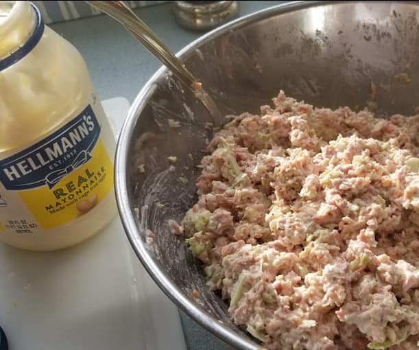
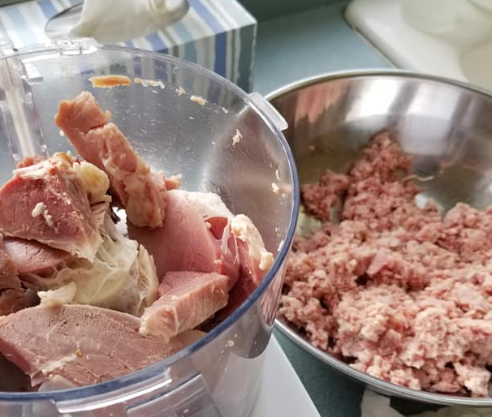
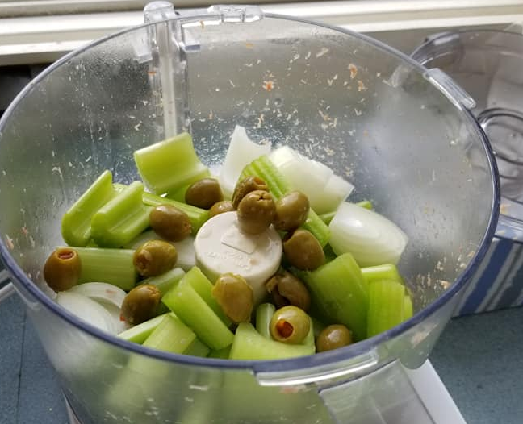
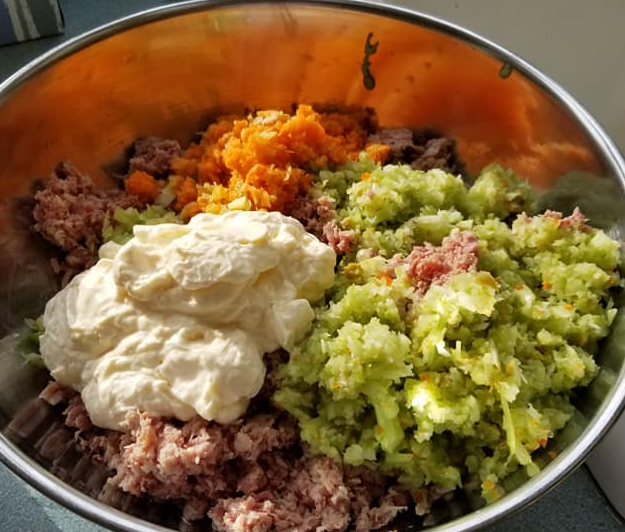

# Ham Salad

Best made with left over ham from Thanksgiving or Christmas.   Almost free to make if timed correctly.  

#### Ingredients

- **Ham:**  fill up 1/2 the food processor.  See picture. 
- **Celery:** 3 or 4 stalks
- **Olives:** 1/2 cup
- **Mayo:**  1 cup or more
- **Carrots:** There was something red in the picture.  I think it was carrots.  What else could it be? 
- **Onion:** 1 large onion chopped finely

  

#### Instructions

- Fill up the food processor with as much ham as you can find.  Grind it up and dump it in a bowl. 
- 
- Next grind up the celery, carrot, onion and olives.
- 
- Put everything in a large bowl and mix.
- 

